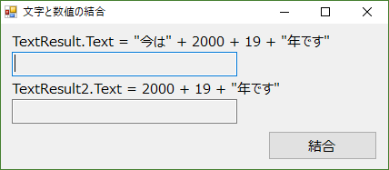

# 概要
ITSS準拠の研修カリキュラム「プログラミングの基礎（B121）」のうち、「文法：式と演算子」の実習として、文字と数字を演算子「＋」で演算した際の挙動について確認します。
作成するアプリケーションはWindows Formを想定しています。
ここで掲示しているプログラムは正解サンプルです。実際の課題実施に際しては、新人にはゼロからプログラムを作ってもらいます。

# 課題

## 事前準備
Visual StudioでC#のWindows Formプロジェクトを作成してください。


## 課題1: 文字と数字の加算

### 新人用説明文
下記の要件を満たすプログラムを作ってください。その後、動作を確認し、「なぜそうなるか」について検討してみてください。

- 2つのテキストボックス（いずれもReadOnly = Trueに設定）と、1つのボタンが配置されている。
- ボタンが押されると、それぞれのテキストボックスのTextプロパティに下記の式を処理結果を設定、表示させてください。年号の数字は適宜調整してください。
  - "今は" + 2000 + 19 + "年です"
  - 2000 + 19 + "年です"

できあがり品のイメージは下図のようになります。



### 講師用補足
ソースのコメントにも記載されていますが、C#は式を評価する際に左の項から順に見ていくため、「数値＋数値」の時点では通常の四則演算を行います。しかし、文字が式内に登場した時点から、数字は「数字文字」として文字列に変換され、加算の演算子は文字列結合演算子として解釈されるようになります。

上段のテキストボックスに出す情報の式は「"今は" + 2000 + 19 + "年です"」。この場合の式解釈の流れは

1. "今は"がstringなので、stringモードで式の解釈が始まる
1. 2000という数字をstringに変換し、「今は2000」という文字列ができる。
1. 19という数字もstringに変換し、「今は200019」になる。
1. 最後の"年"をつけて「今は200019年です」

一方で、下段のテキストボックスは「2000 + 19 + "年です"」。この場合、

1. 冒頭の2000を数字として解釈。
1. 2つめの19も数字なので加算が行われ「2019」に。
1. 最後の"年です"がstringなので、ここまでの「2019」をstringに変換して文字列結合。
１．「2019年です」ができあがる。

となります。

ここでは、C#の内部ロジックに視点を向けるとともに、わかりやすいプログラムと判りづらいプログラムの境界についても関心を持ってもらうことを狙っています。こういった内部処理の仕掛けを知らないと動きを読み間違えるようなプログラムを組むのならば、むしろ暗黙の型変換に依存せず、文字は文字として事前に用意する、といった工夫で可読性を上げる方向で検討するよう仕向けたいところです。


---
# サンプルソース概略
こちらは正解サンプルです。

## JoinStringAndValue
特に入力などは受け付けない、ボタンが押されたら下記の処理を行うだけのプログラムです。

```cs
private void ButtonGo_Click(object sender, EventArgs e)
{
    // 文字(string)とintなどの数値を足し算すると、数値は文字に自動変換される

    // 式は左から解釈されるので、最初に「今は2000」という文字列が作られる。
    // 次に、「今は2000」という文字に「18」が文字として結合される。
    TextResult.Text = "今は" + 2000 + 19 + "年です";

    // 最初に「2000+18」という数値計算が行われる。
    // 次に、2018という数字と文字の足し算なので、数字が文字に自動変換される。
    TextResult2.Text = 2000 + 19 + "年です";
}
```
